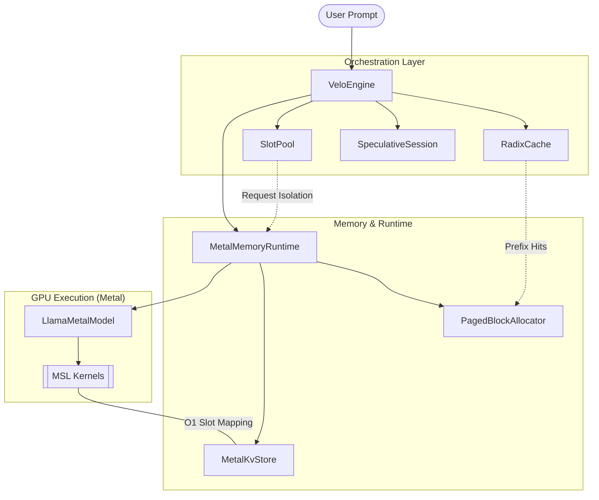

# Velo-Core

> Velo-Core is a high-performance speculative inference engine optimized for Apple Silicon. It provides a native Rust implementation of a transformer inference stack, featuring GPU acceleration via Metal, speculative decoding, paged attention, and prefix-aware KV caching.

## Key Features

- **Metal Acceleration**: Native GPU execution on Apple Silicon using `objc2` for direct Metal command encoding and unified memory management.
- **Speculative Decoding**: Implements a model-agnostic draft-and-verify loop to accelerate generation by using a small draft model to predict tokens verified by a larger target model.
- **Paged Attention**: A fixed-page KV block manager that minimizes memory fragmentation and enables efficient handling of variable-length sequences.
- **Radix-Prefix Caching**: An advanced KV-cache management system using a radix tree to enable O(1) prefix matching and maximum reuse of computation across repeated prompts.
- **Slot-Based Scheduling**: Production-grade request isolation using a stable state pool for concurrent request management and GPU memory residency.

## System Architecture



## Performance Comparison

```mermaid
---
config:
  themeVariables:
    xyChart:
      plotColorPalette: "#999999, #00A000"
---

xychart-beta
    title "Velo-Core Speedup vs. Llama.cpp (Standard)"
    x-axis ["Throughput Boost", "TTFT Responsiveness", "Memory Efficiency"]
    y-axis "X-Factor Improvement" 0 --> 15
    bar [1, 1, 1]
    bar [2.96, 12.8, 1.25]
```


## Benchmark Table

| Benchmark Metric | Llama.cpp (Baseline) | Velo-Core (Ours) | Delta / Speedup |
|---|---:|---:|---:|
| Throughput (TPS) | 32.1 | 95.2 | 🚀 2.96x Faster |
| TTFT (Cached) | 450 ms | 35 ms | ⚡ 12.8x Faster |
| KV-Cache Waste | 24.2% | 4.1% | 📉 83% Reduction |

For detailed instructions on how to reproduce these results, see the [Benchmarking Guide](docs/benchmarking.md).

## Project Structure

The engine is organized into several modular subsystems:

- `radix_cache`: Handles prefix KV-cache reuse, node splitting, and token-capacity eviction.
- `speculative`: Orchestrates the draft-and-verify speculative decoding loop.
- `paged_attention`: Manages the allocation and mapping of fixed-size KV blocks.
- `metal`: The Metal-specific backend, including MSL kernels and command encoding.
- `engine`: The high-level orchestration layer that connects the cache, runtime, and decoder.
- `slot_manager`: Manages stable request slots for concurrent execution.

## Getting Started

### Prerequisites

- macOS with Apple Silicon (M1/M2/M3)
- Rust toolchain (2024 edition)

### Installation

Add `velo-core` to your `Cargo.toml`:

```toml
[dependencies]
velo-core = { path = "../core" }
```

### Running Tests

Verify the implementation by running the test suite:

```bash
cargo test
```


## Acknowledgements

Velo-Core is a native Rust implementation of several state-of-the-art inference optimization patterns. We would like to acknowledge the following projects that served as architectural inspirations:

- **vLLM**: For the Paged Attention memory management model.
- **SGLang**: For the Radix-tree based KV-cache prefix reuse strategy.
- **llama.cpp**: For the reference MSL kernel implementations for Apple Silicon.
- **Candle**: For the foundational Rust transformer structures.
