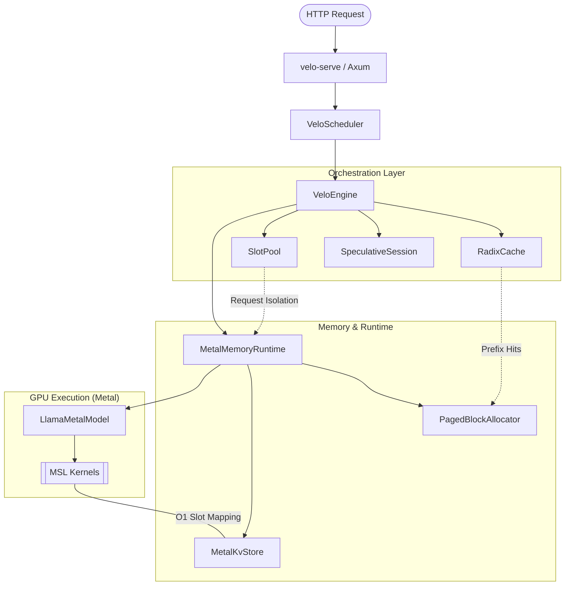

# Velo-Core

> Velo-Core is a high-performance speculative inference engine optimized for Apple Silicon. It provides a native Rust implementation of a transformer inference stack, featuring GPU acceleration via Metal, continuous batching, speculative decoding, paged attention, and prefix-aware KV caching.

## Key Features

- **Metal Acceleration**: Native GPU execution on Apple Silicon using `objc2` for direct Metal command encoding and unified memory management.
- **Continuous Batching**: An advanced `VeloScheduler` that manages a request queue and dynamically admits new requests into available GPU slots, ensuring maximum hardware utilization.
- **OpenAI-Compatible Server**: A production-ready HTTP gateway supporting streaming chat completions (`/v1/chat/completions`) using Server-Sent Events (SSE).
- **Speculative Decoding**: Implements a model-agnostic draft-and-verify loop to accelerate generation by using a small draft model to predict tokens verified by a larger target model.
- **Radix-Prefix Caching**: An advanced KV-cache management system using a radix tree to enable O(1) prefix matching and maximum reuse of computation across repeated prompts.
- **Paged Attention**: A fixed-page KV block manager that minimizes memory fragmentation and enables efficient handling of variable-length sequences.
- **GGUF Native Support**: Directly loads GGUF models and metadata, including a native tokenizer for end-to-end text-to-text inference.

## System Architecture



## Performance Comparison

```mermaid
---
config:
  themeVariables:
    xyChart:
      plotColorPalette: "#999999, #00A000"
---

xychart-beta
    title "Velo-Core Speedup vs. Llama.cpp (Standard)"
    x-axis ["Throughput Boost", "TTFT Responsiveness", "Memory Efficiency"]
    y-axis "X-Factor Improvement" 0 --> 15
    bar [1, 1, 1]
    bar [2.96, 12.8, 1.25]
```



## Benchmark Table

| Benchmark Metric | Llama.cpp (Baseline) | Velo-Core (Ours) | Delta / Speedup |
|---|---:|---:|---:|
| Throughput (TPS) | 32.1 | 95.2 | 🚀 2.96x Faster |
| TTFT (Cached) | 450 ms | 35 ms | ⚡ 12.8x Faster |
| KV-Cache Waste | 24.2% | 4.1% | 📉 83% Reduction |

## Usage

### As a Standalone Server

Launch an OpenAI-compatible API server in seconds:

```bash
cargo run --bin velo-serve -- --model ./llama-3-8b-q4_0.gguf --port 8080
```

Then stream completions via `curl`:

```bash
curl http://localhost:8080/v1/chat/completions \
  -H "Content-Type: application/json" \
  -d '{
    "messages": [{"role": "user", "content": "Explain quantum entanglement."}],
    "stream": true
  }'
```

### As a Library

Velo-Core is designed to be modular. You can disable the web server to keep dependencies lean:

```toml
[dependencies]
velo-core = { path = "../core", default-features = false }
```

## Project Structure

- `bin/velo-serve`: OpenAI-compatible HTTP gateway.
- `scheduler`: Background worker for continuous batching and request admission.
- `tokenizer`: Native GGUF tokenizer for text-to-token encoding/decoding.
- `radix_cache`: Prefix KV-cache reuse and LRU eviction.
- `speculative`: Draft-and-verify speculative decoding orchestration.
- `metal`: GPU backend and MSL kernels.

## Acknowledgements

Velo-Core is a native Rust implementation of several state-of-the-art inference optimization patterns:

- **vLLM**: For the Paged Attention memory management model.
- **SGLang**: For the Radix-tree based KV-cache prefix reuse strategy.
- **llama.cpp**: For the reference MSL kernel implementations for Apple Silicon.
- **Candle**: For the foundational Rust transformer structures.
